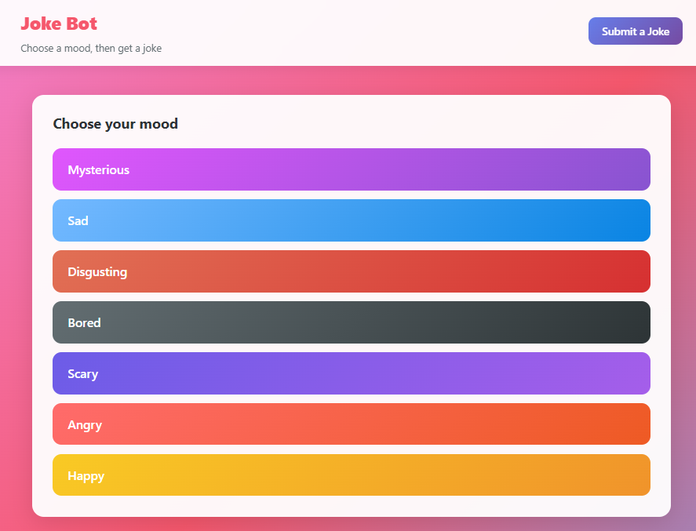
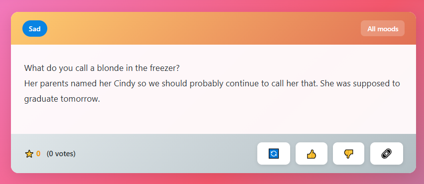
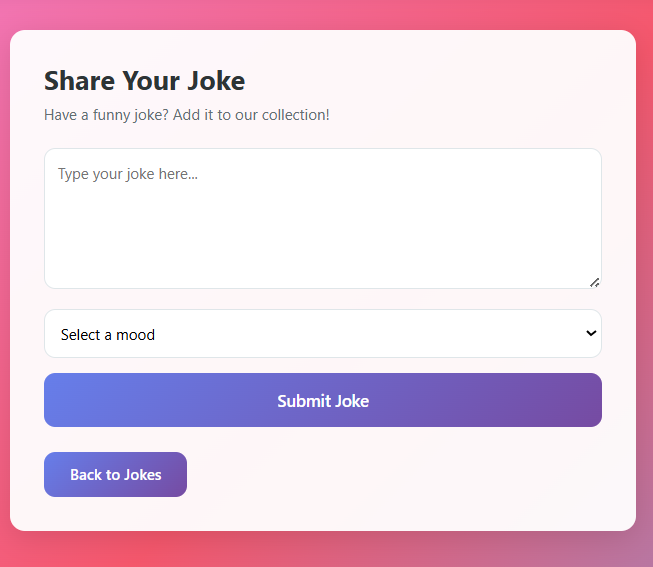

# Joke Bot Web

Web-based joke bot with mood-based selection and rating system — choose your mood, get a joke, rate it!

## Demo







## Product Context

### End Users

- People who want to cheer up himself and search a joke

### Problem

Bot solve the problem of getting a joke that might not fit to user and of wasting time of searching joke

### Our Solution

Joke Bot Web lets users pick one of seven mood categories and returns a random joke weighted by its rating. Users can rate jokes with 👍/👎, stored in PostgreSQL. Available at http://10.93.25.232:5000 with Swagger API docs (`/docs`).

## Features

1. **Database of jokes** — persistent storage with seeding from `jokes.json`
2. **Different emotions** — 7 mood categories: Happy, Sad, Scary, Angry, Mysterious, Disgusting, Bored
3. **Rating of jokes** — Like/Dislike system with one-vote-per-IP protection
4. **"Another one" button** — get a new joke in the same category without returning to the menu
5. **The ability to offer jokes** — user submission with moderation queue (approve/reject)

## Usage

- **Web app** — http://10.93.25.232:5000 — pick a mood, read the joke, rate it 👍/👎, or get another one
- **API** — http://10.93.25.232:5000/docs — `GET /api/categories`, `GET /api/joke/{category}`, `POST /api/rate`, plus submission and moderation endpoints

## Deployment

### Live Server

The app is already running at **http://10.93.25.232:5000**.

### Deploy from Scratch

```bash
git clone https://github.com/Lilia-Shagidullina/se-toolkit-hackathon.git
cd se-toolkit-hackathon
cp .env.docker.example .env
docker compose up -d --build
```

### Docker Compose Services

| Service | Description |
|---------|-------------|
| **backend** | FastAPI — joke API + rating |
| **db** | PostgreSQL 16 — persistent storage |
| **frontend** | Flask — web UI (port 5000) |
| **client** | Nginx — proxy frontend (port 42019) |

### Verify

```bash
docker compose ps
curl http://10.93.25.232:5000/api/categories
curl http://10.93.25.232:5000/api/joke/Happy
```

### Architecture

```
Browser → Flask frontend (:5000)
           ├── FastAPI backend (:8000) → PostgreSQL (:5432)
           └── Nginx client proxy (:42019)
```

## Project Structure

```
se-toolkit-hackathon/
├── client/
│   ├── index.html       # Bootstrap 5 frontend (SPA)
│   ├── nginx.conf       # Nginx: static + /api/* → backend:8000
│   └── Dockerfile       # nginx:alpine
├── src/app/             # FastAPI backend
│   ├── main.py
│   ├── jokes.py         # Business logic + SQLAlchemy models
│   ├── settings.py
│   └── routers/jokes.py # API endpoints
├── jokes.json           # Initial joke data (seeded into DB on startup)
├── docker-compose.yml   # client + backend + postgres + pgadmin
├── Dockerfile           # Backend multi-stage build
├── pyproject.toml       # Python dependencies (FastAPI, SQLAlchemy, etc.)
└── requirements.txt     # Pip requirements
```

## Local Development

### Backend

```bash
# Install dependencies with uv
uv sync

# Run development server with auto-reload
uv run poe dev
```

Open http://localhost:8000/docs for Swagger UI.

### Web Client

The web client is a single-page application served via Nginx. Edit `client/index.html` to modify the UI.

## License

MIT License — see [LICENSE](LICENSE) file for details.
